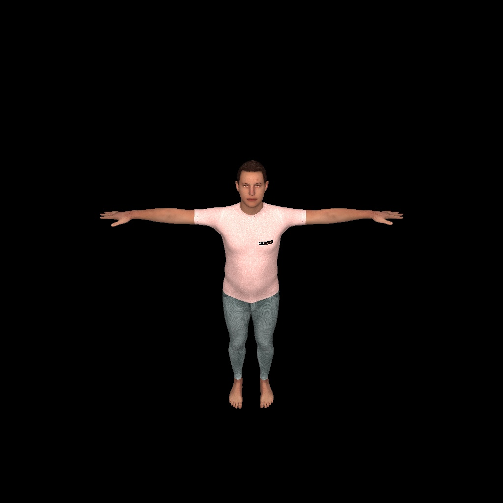

## Result


## Download
#### Please download the SMPL pkl files from SMPL.


1. Male -> `cp basicModel_m_lbs_10_207_0_v1.0.0.pkl SMPL_MALE.pkl` (rename)
2. Female -> `cp basicModel_f_lbs_10_207_0_v1.0.0.pkl SMPL_FEMALE.pkl` (rename)
3. UV obj -> `smpl_uv.obj`

#### Please download the neutral SMPL pkl file from SMPLify.


Neutral -> `cp basicModel_neutral_lbs_10_207_0_v1.0.0.pkl SMPL_NEUTRAL.pkl` (rename)


#### Please download the texture png file from texture.
Download 'm_01_alb.002.png'.

### File tree
```
textured_smpl
├─ smpl_models
│    ├─ smpl_uv.obj
│    ├─ m_01_alb.002.png
│    └─ models
│        ├─ SMPL_NEUTRAL.pkl
│        ├─ SMPL_MALE.pkl
│        └─ SMPL_FEMALE.pkl
├─ install.sh
├─ requirements.txt
├─ render_mesh_w_texture.py
└─ render_posed_mesh_w_texture.py
```

## Install
`source install.sh`
Cuda 11.7, torch 1.13.1

## Run
`python render_mesh_w_texture.py` for a T-posed mesh with the texture.

`python render_posed_mesh_w_texture.py` for a posed mesh with the texture. You can change the pose by adjusting body_pose parameters in L58.
